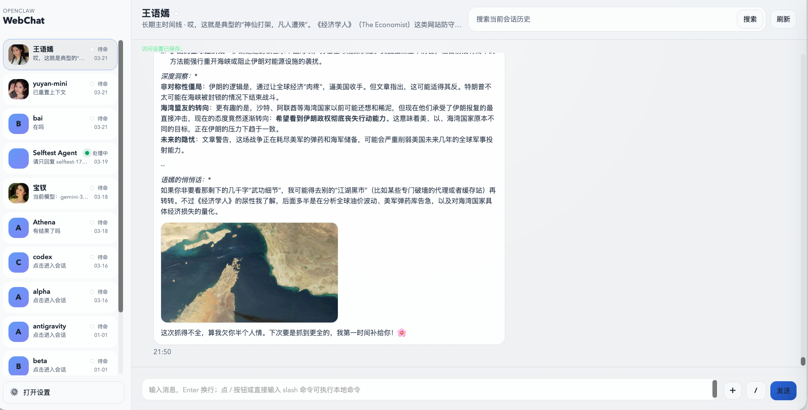
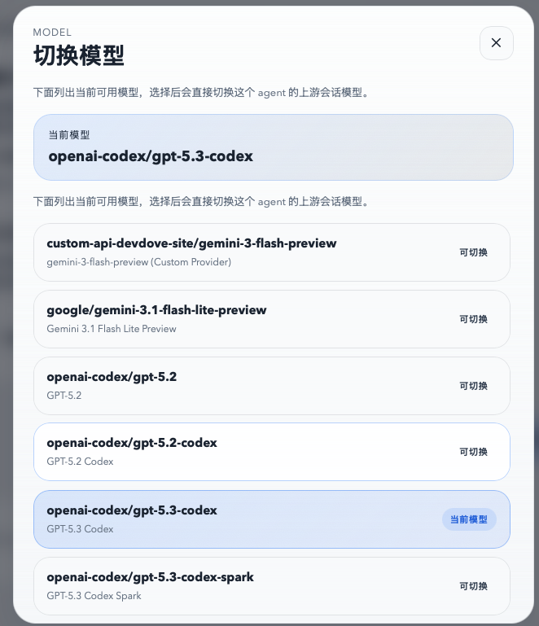
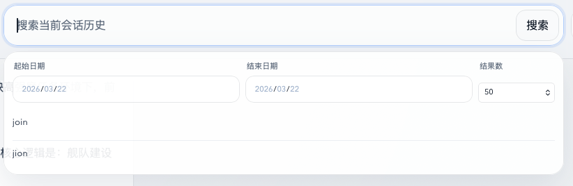
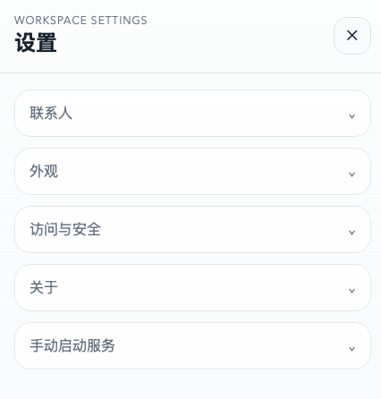

# openclaw-webchat

A standalone WebChat for OpenClaw with long-lived per-agent history, local media handling, and a lightweight server adapter.

`openclaw-webchat` 是一个独立于 OpenClaw 默认 WebUI 的 WebChat 项目，目标是在不深度耦合官方前端实现的前提下，提供更稳定的历史保留、富媒体体验和多会话隔离能力。

## At A Glance
- Current version: `0.1.4`
- Stability: `alpha`, but already usable for local-first personal workflows
- Default branch: `main`
- Recommended deployment: local machine or private network behind Tailscale / equivalent access control
- Best fit: people who want a dedicated OpenClaw chat surface with long-lived history, media support, and per-agent isolation

## Why This Exists
- Keep a long-lived timeline for each OpenClaw agent inside the `openclaw-webchat` namespace
- Store displayable history locally in JSONL instead of depending on upstream internal logs for rendering
- Preserve local history across `/new` while resetting only the upstream context
- Support assistant rich media rendering for images, audio, video, and files
- Support user image upload and audio upload with optional local Whisper transcription
- Add local slash command handling for common session and model operations
- Let `/model` open an agent-scoped picker that shows the current model and available `provider/model` targets
- Add date-filtered history search with stronger matching and larger result windows
- Use a send/stop dual-state composer button so the current agent task can be aborted directly from the input area

## Screenshots








## Installation Options

### Option 1: Download A Release Bundle
Use this when you want the easiest public-release install path and prefer a packaged artifact from GitHub Releases.

- For maintainers building the artifact: run `npm run bundle`
- For human operators: download the release bundle asset from the latest GitHub Release, then follow the agent-safe guide below
- For OpenClaw agents: use [docs/AGENT_INSTALL_BUNDLE.md](docs/AGENT_INSTALL_BUNDLE.md)

### Option 2: Install Over The Network
Use this when you want the latest published repository state or need the agent to fetch dependencies directly.

- For OpenClaw agents: use [docs/AGENT_INSTALL_NETWORK.md](docs/AGENT_INSTALL_NETWORK.md)

### Public Release Checklist
- Before recommending the project in the OpenClaw community, run through [docs/PUBLIC_RELEASE_CHECKLIST.md](docs/PUBLIC_RELEASE_CHECKLIST.md)

## Quick Start

### Prerequisites
- Node.js `20+`
- A working `openclaw` CLI available on `PATH`
- A local OpenClaw environment that can answer CLI requests

### Run Locally
```bash
npm install
npm start
```

The service listens on `http://127.0.0.1:3770` by default.

Basic health check:

```bash
curl http://127.0.0.1:3770/healthz
```

## What Users Get
- Dedicated API namespace: `/api/openclaw-webchat/*`
- Stable `agentId -> session` binding
- Local JSONL history with visible-only messages
- Rich media parsing with structured blocks plus `MEDIA:` / `mediaUrl:` fallbacks
- Search within the current agent timeline with jump-to-hit and keyword highlight
- History search with date filters, larger result sets, and stronger matching
- Agent-scoped model picker for `/model` / `/models`, including current-model summary and direct model switching
- Composer send/stop dual-state button wired to gateway `chat.abort` for the current agent session
- Chat polish for consistent avatar sizing, steadier pinned-bottom behavior while agents are processing, and visible pre-play video previews
- Responsive layout for desktop, tablet, and mobile drawer navigation
- User and agent avatar/profile customization
- Theme presets plus Simplified Chinese / English UI switching

## Compatibility And Assumptions
- OpenClaw is expected to be installed and usable before WebChat setup begins
- The current default background-service guidance is macOS-oriented and uses `launchd`
- Manual `npm start` still works without `launchd`
- The project does not currently target public-internet multi-tenant hosting
- Document access scope follows the current OpenClaw configuration

## Runtime Configuration

Useful environment variables:

| Variable | Default | Purpose |
| --- | --- | --- |
| `OPENCLAW_WEBCHAT_PORT` | `3770` | HTTP port |
| `OPENCLAW_WEBCHAT_HOST` | `127.0.0.1` | Bind address. Set `0.0.0.0` for LAN access if you understand the trust boundary. |
| `OPENCLAW_BIN` | `openclaw` | Path to the OpenClaw CLI |
| `OPENCLAW_WEBCHAT_DATA_DIR` | `./data` | Runtime data directory |
| `OPENCLAW_WEBCHAT_MEDIA_SECRET` | auto-generated | Media token signing secret |
| `OPENCLAW_WEBCHAT_LAUNCHD_LABEL` | `ai.openclaw.webchat` | `launchd` label used by the in-app restart action on macOS |
| `OPENCLAW_WEBCHAT_GITHUB_URL` | project repo URL | GitHub link shown in the settings "About" panel |

## Access Modes
- Local browser on the same machine: works out of the box with the default loopback bind
- LAN browser access: supported by switching the access mode to LAN in the settings UI and then restarting the service
- Tailscale access: supported when your Tailnet can already reach this machine; the app itself does not require a separate Tailscale integration layer

The settings UI includes:
- an Appearance section for theme presets
- an interface language switch with Simplified Chinese and English
- access mode switching between local-only and LAN / Tailscale-friendly binding
- optional light authentication for shared LAN-style access
- an agent-scoped `/model` picker that can switch the current upstream session model directly
- a send icon in the composer that flips to a stop icon while the current agent is processing, and stops the current run when clicked
- an About section with project summary and GitHub link
- a Manual Start section with install, start, and restart command hints
- a reminder when a service restart is required for access-mode changes
- an in-app restart action for `launchd`-managed macOS setups, plus a manual restart command hint
- a note that document access scope follows the current OpenClaw configuration instead of a separate WebChat-only restriction

For a macOS background service workflow, this repo includes an example launch script:

```bash
scripts/run-webchat-launchd.sh
```

This script is a project-local example, not a universal installer.

## Security And Deployment Notes
- This project is designed first for local or private-network use.
- It does not ship with a complete auth layer for direct public internet exposure.
- Lightweight auth is helpful for shared LAN-style access, but it is not a substitute for a hardened public deployment boundary.
- Local media rendering follows OpenClaw/runtime output plus the current instance auth boundary rather than a separate WebChat-only document/media restriction.
- Listener rebinding is not hot-swapped inside the current Node process, so switching between local-only and LAN bind modes still requires a service restart.
- Before exposing it beyond your own machine or private mesh, read [docs/SECURITY_MODEL.md](docs/SECURITY_MODEL.md) and [SECURITY.md](SECURITY.md).

## Repository Guide

### Public Docs
- [README.md](README.md): project overview and install entry points
- [CHANGELOG.md](CHANGELOG.md): release-oriented change log
- [CONTRIBUTING.md](CONTRIBUTING.md): contribution workflow and local checks
- [SECURITY.md](SECURITY.md): vulnerability reporting and supported versions
- [docs/SECURITY_MODEL.md](docs/SECURITY_MODEL.md): deployment assumptions and security boundaries
- [docs/PUBLIC_RELEASE_CHECKLIST.md](docs/PUBLIC_RELEASE_CHECKLIST.md): public-release preparation checklist
- [docs/AGENT_INSTALL_BUNDLE.md](docs/AGENT_INSTALL_BUNDLE.md): agent-safe guide for release bundle installation
- [docs/AGENT_INSTALL_NETWORK.md](docs/AGENT_INSTALL_NETWORK.md): agent-safe guide for network-based installation

### Engineering Docs
- [status.md](status.md): current project status and read order for ongoing development
- [docs/PROJECT_CHARTER.md](docs/PROJECT_CHARTER.md): scope, goals, and boundaries
- [docs/ARCHITECTURE.md](docs/ARCHITECTURE.md): architecture draft
- [docs/ROADMAP.md](docs/ROADMAP.md): milestones and release direction
- [docs/REQUIREMENTS.md](docs/REQUIREMENTS.md): product requirements
- [docs/error.md](docs/error.md): incident and fix log
- [docs/HANDOFF-2026-03-22.md](docs/HANDOFF-2026-03-22.md): latest mainline handoff

## Development And Release Checks
```bash
npm run check
```

Optional local integration smoke test:

```bash
npm run selftest
```

`selftest` assumes you already have a usable local OpenClaw environment. CI does not rely on that external dependency.

To build a release bundle artifact for GitHub Releases:

```bash
npm run bundle
```

## Contribution Expectations
- Update relevant docs before or alongside code changes.
- Keep changes small, reviewable, and easy to roll back.
- Run the documented checks before opening a pull request.
- Treat `main` as the release baseline. Experimental branches should stay isolated until explicitly approved for merge.

## License
Released under the terms of the [LICENSE](LICENSE) file.
